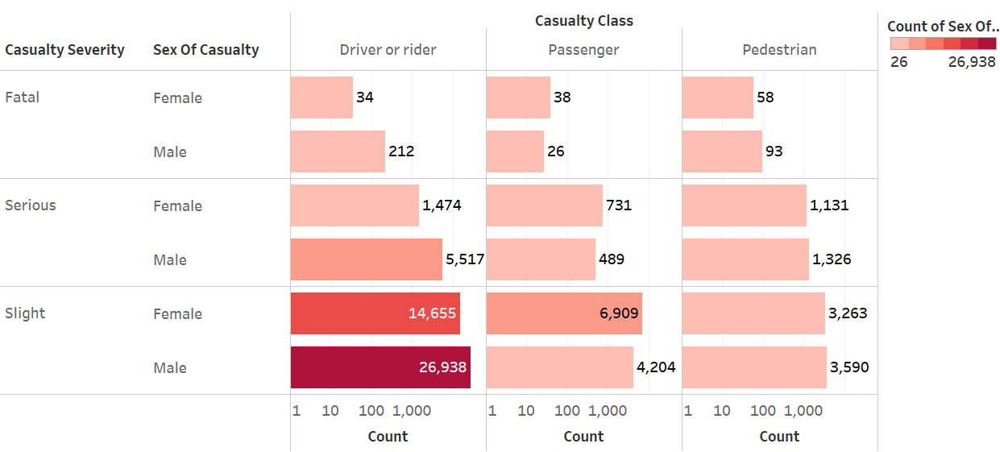
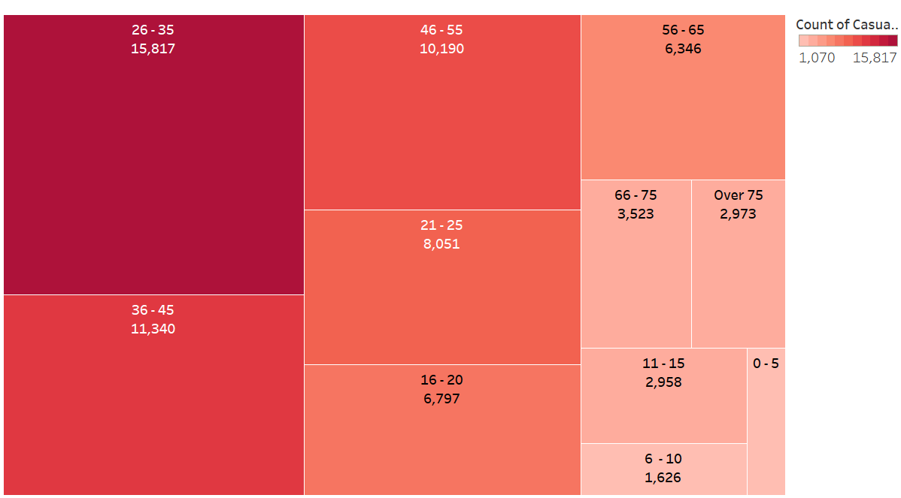
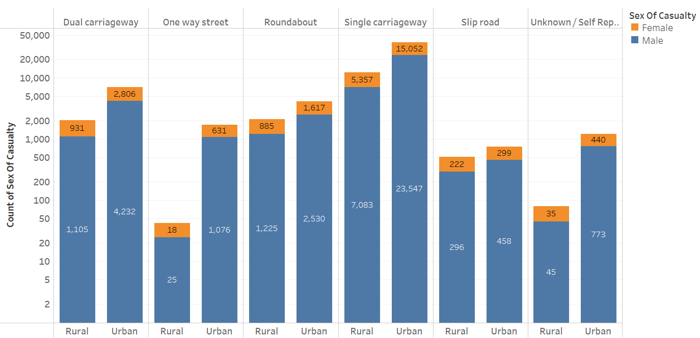
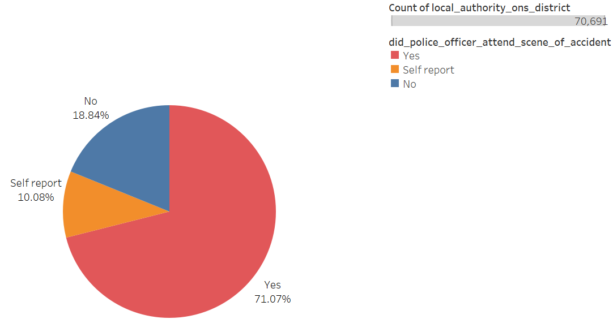
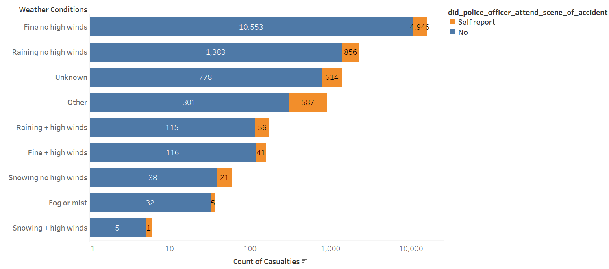
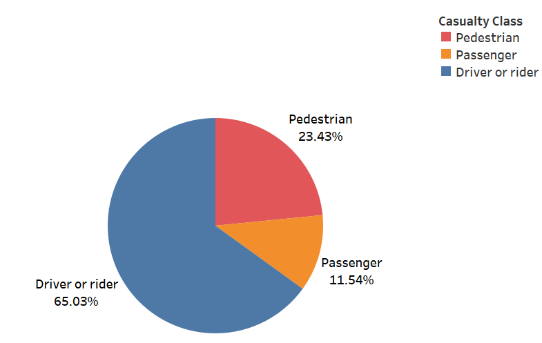
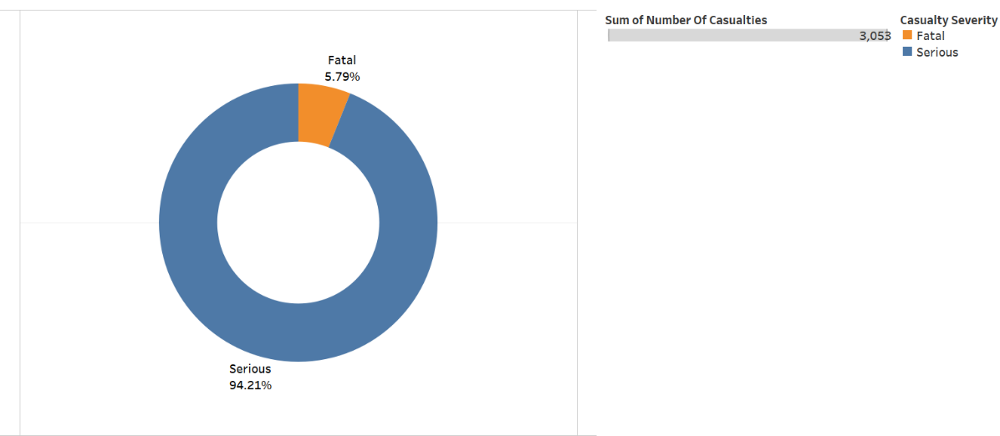
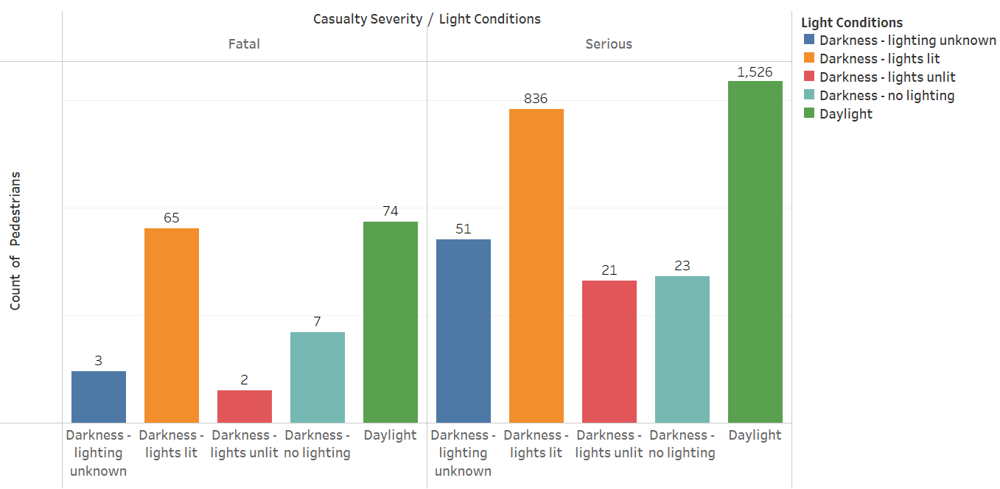
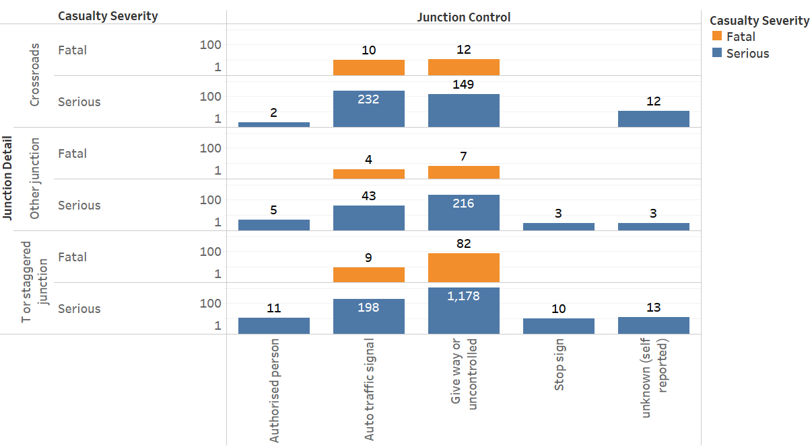

# Road Safety Data Analysis

## Introduction
Road safety is an ongoing concern for drivers worldwide, leaving an indelible scar on victims and their families. The exponential growth of the automobile industry underscores the urgent need to improve road safety. To achieve this, understanding existing conditions and identifying major accident factors and their aftermath are crucial.

In this report, we aim to analyze and provide insights into some of these factors based on the STATS19 dataset.

## Project Team

- Venkat Gopinath Polamuri - [Linkedin](https://www.linkedin.com/in/venkatpolamuri/)
- Anand Samuel Gunti - [Linkedin](https://www.linkedin.com/in/anandgunti/)
- Mayur Shridhar Bhoyar  - [Linkedin](https://www.linkedin.com/in/mayur-bhoyar/)
- Pavan Gorantla Venkatachalapathy - [Linkedin](https://www.linkedin.com/in/pavangorantla/)

## AIM:

Analyse the data containing some road safety data (called STATS19) for England for the 12 months to 31/12/2019, using data and analysis to answer the following questions:

1. What patterns are there in the demographics of casualties?
2. Looking at accidents which included a killed or seriously injured (KSI) casualty, what patterns are there between the local authorities?
3. What patterns are there in pedestrians who were KSI casualties?

## The Data

We have used two datasets for our analysis:
- dft-road-casualty-statistics-accident-2019.csv
- dft-road-casualty-statistics-casualty-2019.csv

The datasets are publicly available on the UK government’s website.

## Data Quality

Data decoding has been carried out as per the Meta data file and the requirements of the project. There are several data quality issues in the given dataset:

### Format Issues
- Column `age_band_of_casualty` has issues with incorrect data entry. The data was entered as `2022-11-15` and `2022 - 06-10`, instead of the age bands `11-15` and `06-10`.
- Date time format has been changed to object data type.

### Data Pre-processing
- As per metadata, 8 police forces were discontinued in 2019, including Northern, Grampian, Fife, Central, Strathclyde, Dumfries and Galloway, Lothian and Borders, and Tayside. Therefore, we have excluded these police forces as there was no related data in the metadata file.
- Column `speed_limit` has missing values. We have dropped the missing values and checked for the valid values as per metadata. In total, 84 values were removed.

## Data Characterization:

We have converted the above-mentioned datasets (csv files) into a pandas DataFrame and merged the datasets into a single dataset using the merge method in Python.

# Description of Columns Used in Analysis:

These columns were selected based on requirements such as demographic-related data, killed or seriously injured (KSI) data, and factors that influence it.

1. `CASUALTY_SEVERITY`: Severity of the person involved.
2. `SEX_OF_CASUALTY`: Gender of the person involved.
3. `CASUALTY_CLASS`: Describes whether the person is a passenger, driver, or pedestrian.
4. `CASUALTY_TYPE`: Mode of transport the person was using.
5. `AGE_BAND_OF_CASUALTY`: Determines the age of the casualty.
6. `ACCIDENT_INDEX`: Serial number of accidents.
7. `ACCIDENT_SEVERITY`: Describes how serious the accident was.
8. `NUMBER_OF_CASUALTIES`: Number of casualties involved in an accident.
9. `DAY_OF_WEEK`: The day when the accident happened.
10. `ROAD_TYPE`: Specifies the road type where the accident had taken place.
11. `JUNCTION_DETAIL`: Type of junction (e.g., roundabout or crossroad).
12. `JUNCTION_CONTROL`: State of junction control (e.g., automatic or controlled).
13. `LIGHT_CONDITIONS`: Condition of light at the time of the accident.
14. `WEATHER_CONDITIONS`: Weather condition at the time of the accident.
15. `URBAN_OR_RURAL_AREA`: Area type where the accident has occurred.
16. `DID_POLICE_OFFICER_ATTEND_SCENE_OF_ACCIDENT`: Describes whether police attended the accident scene or not.

# Variable Overview

| VARIABLE                               | Type        | Sample Data                   | Missing Values    |
|----------------------------------------|-------------|-------------------------------|-------------------|
| CASUALTY_SEVERITY                      | Categorical | Fatal, Serious, Slight       | No Data Missing   |
| SEX_OF_CASUALTY                        | Nominal     | Male, Female                  | 713 Values Missing |
| CASUALTY_CLASS                         | Categorical | Driver, Passenger            | No Data Missing   |
| CASUALTY_TYPE                          | Categorical | Cyclist, Taxi, Bus etc.      | 5 Values Missing  |
| AGE_BAND_OF_CASUALTY                   | Nominal     | 0-5, 6-10…, over 75           | 3234 Values Missing |
| ACCIDENT_INDEX                         | Numerical   | 2019010128300                 | No Data Missing   |
| ACCIDENT_SEVERITY                      | Categorical | Fatal, Serious, Slight       | No Data Missing   |
| NUMBER_OF_CASUALTIES                   | Numerical   | 1, 2, 3, 5 etc.              | No Data Missing   |
| DAY_OF_WEEK                            | Date/time   | Monday, Tuesday etc.         | No Data Missing   |
| ROAD_TYPE                              | Nominal     | Single, dual carriageway etc.| No Data Missing   |
| JUNCTION_DETAIL                        | Nominal     | Slip road, crossroads etc.    | 1 Value Missing   |
| JUNCTION_CONTROL                       | Nominal     | Stop sign, Auto traffic signal etc.| 62157 Values Missing |
| LIGHT_CONDITIONS                       | Nominal     | Daylight, darkness (lit & unlit) etc.| 1 Value Missing |
| WEATHER_CONDITIONS                     | Nominal     | Wind, snow, raining etc.     | No Data Missing   |
| URBAN_OR_RURAL_AREA                    | Categorical | Urban, rural                  | 29 unknown values |
| DID_POLICE_OFFICER_ATTEND_SCENE_OF_ACCIDENT | Boolean | Yes or No                     | 9943 Values Missing |

# Detailed Analysis

## Patterns in the Demographics of Casualties

### Fig. 1.1

Fig 1.1 illustrates the relationship between casualty severity, sex, and casualty class in accidents. It shows that the maximum number of people who are drivers or riders experience slight injuries, with females accounting for 14,655 and males for 26,938. However, among passengers, a higher number of slight injuries occur among females. In the case of pedestrians, both sexes are almost equally likely to sustain slight injuries.

### Fig. 1.2

Fig 1.2 displays the count of casualties based on age bands. It indicates that the age band of 26 to 35 has the highest number of casualties, with 15,817 individuals involved in accidents. The casualties in the age bands of 36 to 45 and 46 to 55 are nearly the same, around 11,000 each.

### Fig. 1.3

Fig. 1.3 illustrates the relation between accidents that occurred on different road types based on the area (urban or rural) and the sex of the casualty. It shows that urban single carriageway road types have the maximum number of casualties, with around 15,000 females and 23,500 males. The data also suggests that casualties are more likely to occur in urban areas compared to rural areas.

## Patterns Between Local Authorities in Accidents with Killed or Seriously Injured (KSI) Casualties

### Fig 2.1

Fig 2.1 shows the proportion of cases attended by the police at the accident scene. It reveals that 71.07% of cases were attended, 18.84% were left unattended, and 10.08% were self-reported. This implies that 28.94% of cases were not attended by the police. 

### Assumption 1:

Fig 2.2 depicts the number of fatal and serious cases left unattended on each day of the week. It shows a uniform distribution of unattended cases across the week, refuting the assumption that unattended cases occurred during the busiest period of the week.

### Assumption 2:

Fig 2.3 shows the distribution of unattended cases based on weather conditions. It indicates that the most unattended cases occurred during 'Fine no high wind' and 'Raining no high wind' conditions, suggesting no correlation between unattended cases and weather condition.

## Patterns in Pedestrians who were KSI Casualties

### Fig. 3.1

Fig 3.1 is a pie chart representing the distribution of casualty classes. It shows that pedestrians accounted for around 24% of casualties, with the majority being serious or fatal.

### Fig. 3.2

Fig 3.2 illustrates the share of fatal and serious casualties among pedestrians. It shows that 94% of reported casualties are serious, while around 6% are fatal.

### Fig. 3.3

Fig 3.3 illustrates the light conditions during serious and fatal casualties. It indicates that most incidents occurred during daylight, followed by darkness with lit lights. Only a small percentage of incidents occurred in darkness with no lighting.

From these findings, it can be inferred that most casualties occurred in daylight, suggesting further investigation into the reasons behind these incidents, such as possible negligence.

### Fig. 3.4

Fig 3.4 illustrates the casualty severity (fatal or serious) based on junction detail and junction control. It suggests that the maximum casualties have occurred at T or staggered junctions where the junction control is a Give way or uncontrolled. It can be inferred that fatal casualties in pedestrians were minimum where there is control, and whenever there is an authorized person or stop sign at the junction control, the number of casualties was minimal. Even though there is an auto traffic signal controller, there were considerable serious casualties that occurred. Based on these findings, it can be concluded that exerting control at a junction reduces the probability of casualties in pedestrians.

## Conclusion:

The raw data obtained were merged and cleansed. We have sliced the required columns according to tasks required for the analysis. Through the casualty demographics, we could infer that 65% of drivers or riders of both genders and people around the age band of 26-45 are more vulnerable to accidents of all severity types. The assumptions used in the analysis to study the behavior of authorities illustrate that weather conditions or the busiest period of the week were not the reasons for the police not appearing at the accident scene. There is no additional data to prove that the police had any other valid reason for their absence. The study on pedestrian casualties reveals that 94% of accidents involving a pedestrian were serious and mostly occurred during the daytime and at T junctions or crossroads. Further investigation is needed regarding the cause of pedestrian casualties during the daytime and deploying manpower at junction controls to reduce casualties, as the report suggests that when there is an authorized person at the junction control, fatal casualties were zero.

